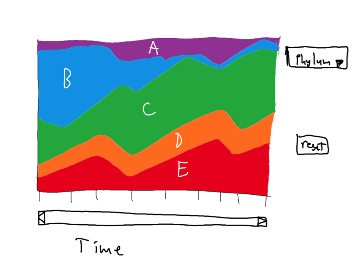
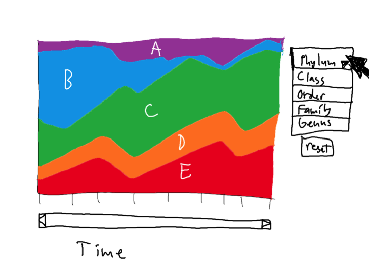
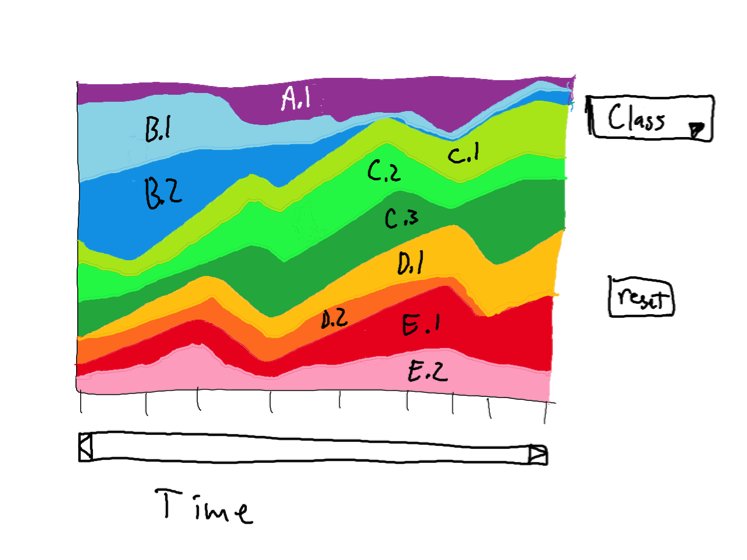
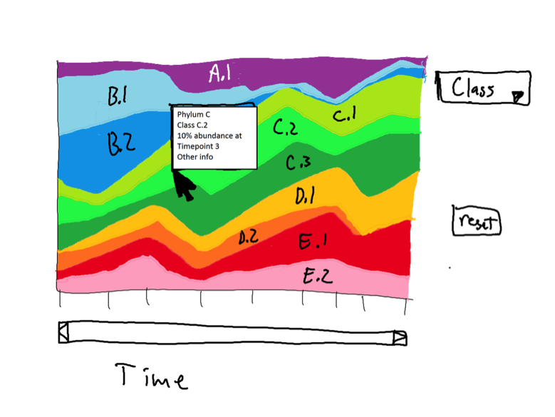

## a3-cnoecker-engal-cmcn

1. Cecilia Noecker cnoecker@uw.edu
2. Alex Eng engal@uw.edu
3. Colin McNally cmcn@uw.edu

## Exploring gut microbial community composition over time

Our visualization explores a dataset of the taxonomic composition of the gut microbiomes of 2 subjects over one year [(David et al Genome Biology 2014)](http://genomebiology.com/2014/15/7/R89). We chose to use an interactive stacked area chart, in which you can switch between taxonomic levels, isolate taxonomic groups to compare their trends over time, and vary the time scale resolution to view short- and long-term variation.
The stacked area plot is an effective and intuitive visualization strategy for time series compositional (relative abundance) data. Switching between taxonomic levels is useful because both broad overview phylogenetic trends and specific interactions between species could be of interest. Zooming in and out is useful because both fine-scale dynamics and large-scale variation might be interesting.

## Running Instructions

Please find our visualization at http://cse512-15s.github.io/a3-cnoecker-engal-cmcn/ . Alternatively, download this repository and run `python -m SimpleHTTPServer 9000` and access this from http://localhost:9000/. Clicking on a stripe in the plot subsets the data to show that group at one level finer taxonomic resolution.

## Story Board

### Changes between Storyboard and the Final Implementation

We largely followed our planned storyboard. We added the feature of clicking on a subset of data to see it at a finer taxonomic scale. We originally intended to have a cohesive color scheme through the entire plot (e.g. everything within the Firmicutes phylum colored a shade of red, everything within Bacteroides a shade of blue, etc), but ran into some difficulties implementing such a complex color scale in a way that worked with all the other features. This would be doable and desirable with a bit more time. 

## Development Process

Breakdown of how the work was split among the group members:
- Alex formatted and organized the data, generated mapping files between the different taxonomic levels, set up the GitHub account. 
- Cecilia made the initial area plot, wrote the switching between the two donors, wrote the mouseover tooltip, and wrote the clicking to subset data.
- Colin drew the storyboard, set up the switching between taxonomic levels, and created the zoom slider and time scaling.  

Time spent: 8-10 hours a person

The most time-consuming aspects were simply learning to use d3 and solving bugs related to the relatively unique structure of the taxonomic data - making sure the ordering was consistent across taxonomic levels and plot drawings and so on.
